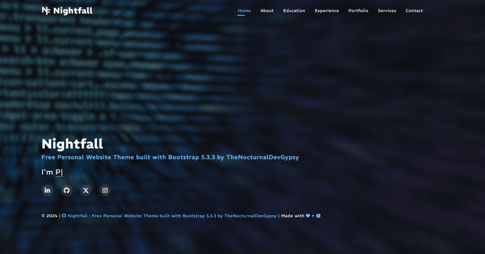

<h3 align="center">NightFall</h3>

<em>Free Personal Website Theme built with Bootstrap 5.3.3 by TheNocturnalDevGypsy</em>

<strong>You like the Repo? Don't forget to 🌟, 👁️, 🔱 and ❤️!</strong>

   
   
   
   
   
   
   
   
   

## 
This document contains the complete chronological list of updates and changes to the project

## 

Version Latest Live URL: https://nightfall-eight.vercel.app/

| Version | Date | Commit | Type | Description |
| ------------- | ------------- | ------------- | ------------- | ------------- |
| 2.0.0 | 03.12.2024 | [fbe2a27](https://github.com/thenocturnaldevgypsy-io/nightfall-bootstrap-template-personal/commit/fbe2a2749efe82420118841651f4844dee4b3a21) for [PR 11](https://github.com/thenocturnaldevgypsy-io/nightfall-bootstrap-template-personal/pull/11) | refactor/perf/chore | - Updated the full template from one page to multi-page template - Rechecking the CSS respositive, added more clearer comments - Removed the old deployments that was linked to my old GitHub account at Vercel and Netlify, redeployed the latest version at Vercel (https://nightfall-eight.vercel.app) - Updated the repo's documentation |

## 

| Version | Date | Commit | Type | Description |
| ------------- | ------------- | ------------- | ------------- | ------------- |
| 1.2.2 | 20.10.2024 | [a1d83bd](https://github.com/thenocturnaldevgypsy-io/nightfall-bootstrap-template-personal/commit/a1d83bdcec79df4879ae65dd5b770ddd0889c0ba) for [PR 2](https://github.com/thenocturnaldevgypsy-io/nightfall-bootstrap-template-personal/pull/2), [90b7784](https://github.com/thenocturnaldevgypsy-io/nightfall-bootstrap-template-personal/commit/90b7784409d954c01fe0ee237176f08257150786) for [PR 4](https://github.com/thenocturnaldevgypsy-io/nightfall-bootstrap-template-personal/pull/4) | feat | - Old GitHub account [@thenocturnaldevgypsy](https://github.com/thenocturnaldevgypsy) got flagged for no reason given, recreating the repo to the new account [@thenocturnaldevgypsy-io](https://github.com/thenocturnaldevgypsy-io) [[PR 2](https://github.com/thenocturnaldevgypsy-io/nightfall-bootstrap-template-personal/pull/2)] - Redeployed at Vercel, Live URL: https://nightfall-eight.vercel.app/, updated documentation [[PR 4](https://github.com/thenocturnaldevgypsy-io/nightfall-bootstrap-template-personal/pull/4)] - Details of the whole migration, see GitHub Project: [Migrating @thenocturnaldevgypsy to @thenocturnaldevgypsy-io](https://github.com/users/thenocturnaldevgypsy-io/projects/1/views/1) |
| 1.2.1 | 16.10.2024 | [7fa46dc](https://github.com/thenocturnaldevgypsy/nightfall-bootstrap-template-developer-portfolio/commit/7fa46dc29b2c4589f2936470847537c702c97dcb) for [PR 6](https://github.com/thenocturnaldevgypsy/nightfall-bootstrap-template-developer-portfolio/pull/6) | feat | *NOTE: For the complete ticket logs/activities, please see [Issue 5](https://github.com/thenocturnaldevgypsy/nightfall-bootstrap-template-developer-portfolio/issues/5)*  - Added `Image Sources Credits` at `README.md` because the Authors/Owners deserved it.  - Created version 1.2.1 using Bootstrap 5.3.3 (SEO and Sample Content). -- Added the necessary SEO tags at the `<head></head>`, created a draft `robots.txt`  -- Started with the One-Page Template, created the following sections: --- Header/Navigation --- Home --- About --- Resume --- Portfolio --- Services --- Contact --- Footer  Deployed at Netlify (Ref: [Issue 12](https://github.com/thenocturnaldevgypsy/nightfall-bootstrap-template-personal/issues/12)) : https://nightfall-bootstrap-template.netlify.app/ |
| 1.1.1 | 12.10.2024 | [8631236](https://github.com/thenocturnaldevgypsy/nightfall-bootstrap-template-developer-portfolio/pull/4/commits/8631236253cde72f2b528f63e7228a2fbe1fe0f4) for [PR 4](https://github.com/thenocturnaldevgypsy/nightfall-bootstrap-template-developer-portfolio/pull/4) | feat | Updated repo documentation using https://github.com/thenocturnaldevgypsy/github-md-template |
| 1.1.0 | 15.09.2024 | [f603f78](https://github.com/thenocturnaldevgypsy/nightfall-bootstrap-template-developer-portfolio/commit/f603f78ce1873ed514b6743800422f6c86b9a0c9) | feat | - Updated the Documentation Structure of the Repo - Created `CHANGELOG.md` and `CONTRIBUTING.md` - Renamed the main CSS and JS files to match the theme's name |
| 1.0.1 | 08/09/2024 | [d37e864](https://github.com/thenocturnaldevgypsy/nightfall-bootstrap-template-developer-portfolio/commit/d37e864171e7ea136242b7f05cfb609ea07de06b) | feat | Started the project, decided which tools to be used, setup the repo to private while working on the project's draft, finished the initial directory design, created `README.md`, `LICENSE`, `FUNDING.yml`. |