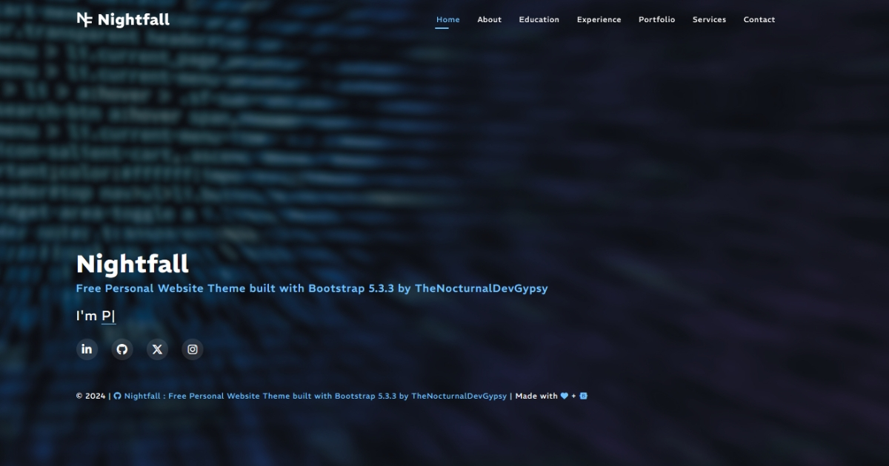

<p align="center"></p>
<h3 align="center">NightFall</h3>
<p align="center"><em>Free Personal Website Theme built with Bootstrap 5.3.3 by TheNocturnalDevGypsy</em></p>
<p align="center"><strong>You like the Repo? Don't forget to 🌟, 👁️, 🔱 and ❤️!</strong></p>
<p align="center">
   
   
   
   
   
   
   
   
   <a href="https://ko-fi.com/thenocturnaldevgypsy">
      
   </a>
</p>

## 

`NightFall` is one of my active personal project for refreshing my skills with the latest Bootstrap's release (5.3.3), focusing with creating a Responsive (`mobile`, `tablet` and `desktop`) Template that can be used for personal or portfolio website.


- Added all the necessary SEO Required Tags and Files to make it SEO Ready.
- Available in Muti-Pages Template: Home, About, Education, Experiences, Services and Contact


- Thru Vercel : https://nightfall-eight.vercel.app

## 

**IDE and OS**
```
Version: 1.93.1 (user setup)
Commit: 38c31bc77e0dd6ae88a4e9cc93428cc27a56ba40
Date: 2024-09-11T17:20:05.685Z
Electron: 30.4.0
ElectronBuildId: 10073054
Chromium: 124.0.6367.243
Node.js: 20.15.1
V8: 12.4.254.20-electron.0
OS: Windows_NT x64 10.0.19045
```
**Web Server and Database**
```
MAMP by MAMP GmbH
Version: 5.0.6 (7029)
x64 binaries release

PHP version: 8.3.1
Database client version: libmysql - mysqlnd 8.3.1 
phpMyAdmin Version information: 5.1.2
```
**Frameworks, Libraries and Tools**
```
- Bootstrap 5.3.3 https://github.com/twbs/bootstrap
- Google Font: REM https://fonts.google.com/specimen/REM?query=rem
- Bootstrap Icons https://github.com/twbs/icons
- FontAwesome 6 Icons (Free) https://github.com/FortAwesome/Font-Awesome
- AOS (Animate on scroll) https://github.com/michalsnik/aos
- imagesLoaded https://github.com/desandro/imagesloaded
- Isotope https://github.com/metafizzy/isotope
- purecounterjs https://github.com/srexi/purecounterjs
- Swiper.js https://github.com/nolimits4web/swiper
- Typed.js https://github.com/mattboldt/typed.js
- Waypoint.js (No Framework) https://github.com/imakewebthings/waypoints
```
**Image Sources Credits**
- [Coding, Computer, Hacker image. Free for use - Assets by Pexels](https://pixabay.com/photos/coding-computer-hacker-hacking-1841550/) : `assets/images/hero-bg.jpg`
- [Adult, Blue hour, Brunette image. Free for use - Assets by Pexels](https://pixabay.com/photos/adult-blue-hour-brunette-city-2179060/) : `assets/images/profile-img.jpg`
- [Adult, Architecture, Building image. Free for use - Assets by Pexels](https://pixabay.com/photos/adult-architecture-building-2178861/) : `assets/images/testimonials/testimonials-1.jpg`
- [Woman, Adult, Dress image. Free for use - Assets by Pexels](https://pixabay.com/photos/woman-adult-dress-elegant-fashion-2178816/) : `assets/images/testimonials/testimonials-2.jpg`
- [Barnett, Concert, Courtney image. Free for use - Assets by Pexels](https://pixabay.com/photos/barnett-concert-courtney-live-music-2178772/) : `assets/images/testimonials/testimonials-3.jpg`
- [Beautiful, Fashion, Female image. Free for use - Assets by Pexels](https://pixabay.com/photos/beautiful-fashion-female-girl-2178708/) : `assets/images/testimonials/testimonials-4.jpg`
- [Black, Black and white, Emotions image. Free for use - Assets by Pexels](https://pixabay.com/photos/black-black-and-white-emotions-2178681/) : `assets/images/testimonials/testimonials-5.jpg`
- [Cellphone, Smartphone, Vpn image. Free for use - Assets by StefanCoders](https://pixabay.com/photos/cellphone-smartphone-vpn-streaming-5494593/) : `assets/images/portfolio/app-1.jpg`
- [Vpn, Virtual private network, Public wifi image. Free for use - Assets by StefanCoders](https://pixabay.com/photos/vpn-virtual-private-network-4667364/) : `assets/images/portfolio/app-2.jpg`
- [Vpn, Personal data, Streaming image. Free for use - Assets by StefanCoders](https://pixabay.com/photos/vpn-personal-data-streaming-unlock-4600767/) : `assets/images/portfolio/app-3.jpg`
- [Your Soul Is a River by Nikita Gill Book. Free for use - Assets by Thought Catalog](https://www.pexels.com/photo/your-soul-is-a-river-by-nikita-gill-book-904620/) : `assets/images/portfolio/book-1.jpg`
- [Person Holding A Book. Free for use - Assets by Thought Catalog](https://www.pexels.com/photo/person-holding-a-book-2228556/) : `assets/images/portfolio/book-2.jpg`
- [Flatlay Photo Of A Book. Free for use - Assets by Thought Catalog](https://www.pexels.com/photo/flatlay-photo-of-a-book-2228562/) : `assets/images/portfolio/book-3.jpg`
- [Woman On Bed Inside Room. Free for use - Assets by Thought Catalog](https://www.pexels.com/photo/woman-on-bed-inside-room-2228566/) : `assets/images/portfolio/brand-1.jpg`
- [Cooked Food On A Plate. Free for use - Assets by Thought Catalog](https://www.pexels.com/photo/cooked-food-on-a-plate-2228559/) : `assets/images/portfolio/brand-2.jpg`
- [Woman Sitting On Window Reading Book. Free for use - Assets by Thought Catalog](https://www.pexels.com/photo/woman-sitting-on-window-reading-book-2228561/) : `assets/images/portfolio/brand-3.jpg`

## 

At the moment, the repository contains the following structure, where:
```
project-root/
├─ assets/              # assets folder for images, css, js and other libraries
│  ├─ images/           # main directory for storing image files
│  │  ├─ favicons/      # favicons for the website
│  │  ├─ portfolio/     # portfolio mockup images
│  │  └─ testimonials/  # testimonial thumbnails
│  ├─ css/              # main directory for storing css files
│  ├─ js/               # main directory for storing js files
│  └─ library/          # main directory for the framework and libraries used
├─ md_assets/           # assets folder for markdown files (documentation)
├─ .gitignore           # files ignored by Git
├─ CHANGELOG.md         # project changelog documentation
├─ LICENSE              # license file
└─ README.md            # project documentation
```
| Description | File/s |
| ------------- | ------------- |
| Home Page of the template | `index.html` |
| Main CSS of the template | `assets/css/main.styles.css` |
| Main JS of the template | `assets/js/main.core.js` |

##  

```
Home/
  ├─ Short Introduction/
  ├─ Copyrights and Notes/
  └─ Social Network Details/ 

About/
  ├─ Introduction/
  ├─ Counters/
  ├─ My Skills, Domain Knowledge/
  │  ├─ Skill Bars/
  │  └─ Tech Stack/
  └─ Testimonials/

Education/
  ├─ Formal Education/
  ├─ Certificates, Licenses/
  └─ Online Learning and Code Challenges/
 
Experience
  ├─ Recent/
  └─ Previous/
   
Portfolio/   
  └─ Portfolio Details/    
  
Services/  
  └─ Service Details/

Contact/

Footer/
  ├─ Copyrights and Notes/
  └─ Social Network Details/
```
- **Home**: Simple splash screen of the website, Copyrights, Notes and Social Network Details
   - HTML files: `index.html`
- **About**: About the site owner
   - HTML files: `about.html`
- **Education**: Records of formal education to professional certifications and online courses taken
   - HTML files: `education.html`
- **Experience**: Records of recent and previous experiences
   - HTML files: `experience.html`
- **Portfolio**: Portfolio details
   - HTML files: `portfolio.html`, `portfolio-details.html`
- **Services**: Services offered
   - HTML files: `services-1.html`
- **Contact**: Hiring, shops and contact details
   - HTML files: `contact.html`
- **Footer**: Copyrights, Notes and Social Network Details. (except Home (`index.html`))

## 
See the [open issues](https://github.com/thenocturnaldevgypsy-io/nightfall-bootstrap-template-personal/issues) and [backlog](https://github.com/thenocturnaldevgypsy-io/nightfall-bootstrap-template-personal/milestones) for the list of proposed features (and known issues).

## 

Below is the latest updates, go to the [Changelog Listing](CHANGELOG.md) for the complete information.

| Version | Date | Commit | Type | Description |
| ------------- | ------------- | ------------- | ------------- | ------------- |
| 2.0.0 | 03.12.2024 | [fbe2a27](https://github.com/thenocturnaldevgypsy-io/nightfall-bootstrap-template-personal/commit/fbe2a2749efe82420118841651f4844dee4b3a21) for [PR 11](https://github.com/thenocturnaldevgypsy-io/nightfall-bootstrap-template-personal/pull/11) | refactor/perf/chore | - Updated the full template from one page to multi-page template<br>- Rechecking the CSS respositive, added more clearer comments<br>- Removed the old deployments that was linked to my old GitHub account at Vercel and Netlify, redeployed the latest version at Vercel (https://nightfall-eight.vercel.app)<br>- Updated the repo's documentation |

## 
Want to contribute? Great! Contributions welcome, but please read the [contribution guidelines](CONTRIBUTING.md) first on how to contribute to the project, including pull request guidelines and community contributions.

## 

If you'd like to use this repo for your own project, I would like to ask a favor from you:
- Please do 🌟 and 👁️ this repo (or, maybe ❤️ by buying me a ☕ at **Ko-Fi**? :smiling_face_with_tear:).
- Click `Fork` at the top of this page.
- Please be mindful of the [LICENSE](LICENSE.md) applicable

## 
Distributed under the MIT License by [Abegail Torrendon / TheNocturnalDevGypsy](https://github.com/thenocturnaldevgypsy-io).
- You can freely modify and reuse.
- The original [LICENSE](LICENSE.md) must be included with copies of this software.
- Please link back (if you can fork, the better) to this repo. 

## 
I'd love to hear your thoughts on the project and get your suggestions. Feel free to [create new issue](https://github.com/thenocturnaldevgypsy-io/nightfall-bootstrap-template-developer-portfolio/issues/new) on this repo or you can also contact me by [creating a new discussion](https://github.com/thenocturnaldevgypsy-io/thenocturnaldevgypsy-io/discussions/new?category=ask-me-anything-ama-and-q-a) at **💬 Ask Me Anything! (AMA and Q&A)** category under my GitHub Profile Repo's Discussions